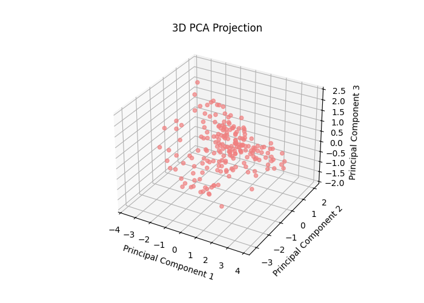

# SMAI ASSIGNMENT - 2

## Name: Shaik Affan Adeeb
## Roll No: 2022102054

## 3.K-Means Clustering

Below is the plot of WCSS vs K :

  

## WCSS Values for k from 1 to 20

Below are the WCSS values for k= 1 to 20:

| k  | Value                | k  | Value                |
|----|----------------------|----|----------------------|
| 1  | 4527.93663666962      | 11 | 3716.32627055918     |
| 2  | 4256.63878018003      | 12 | 3679.363044307139    |
| 3  | 4227.504432396106     | 13 | 3639.036395844953    |
| 4  | 4116.277846360869     | 14 | 3626.949130114801    |
| 5  | 4051.676408418285     | 15 | 3599.925667675919    |
| 6  | 3983.498075469539     | 16 | 3566.7774621082312   |
| 7  | 3939.4794146512727    | 17 | 3545.2480577490214   |
| 8  | 3863.1535285959408    | 18 | 3517.521228777883    |
| 9  | 3836.09954265137      | 19 | 3495.2191119318795   |
| 10 | 3761.2662758735532    | 20 |  |

From the plot after k = 3 the WCSS remains almost constant. 

So therefore **K_kmeans1 = 3**

Below is the clustering plot for the datset given in moodle announcement to test:

  

 

## 4. Gaussian Mixture Models

The class works as expected. The GMM class uses the Expectation-Maximization (EM) algorithm, alternating between calculating the responsibilities in the E-step and updating the parameters in the M-step. It reaches convergence when the change in log-likelihood drops below a specified tolerance (`tol`), signaling that the model has found a good solution.

### Using BIC (Bayesian Information Criterion) and AIC (Akaike Information Criterion)
Below is the BIC and AIC plot:

  

- The GMM model performs well, as we can observe from the graph where the log-likelihood value stabilizes after a few iterations, indicating that further changes in clusters are minimal as the GMM algorithm progresses.
- The graph also shows a steady increase in both BIC and AIC values starting from 1.
- The **optimal number of clusters (kgmm1)**, based on this graph, appears to be 1, where both BIC and AIC values are relatively low, and improvements in the model's fit taper off beyond this point.
- **Kgmm1 = 1**

Below are cluster plots for visualization taking forst two cloloumns:

  

## 5 Dimensionality Reduction and Visualization

The new axes created by PCA are called **principal components**. These are combinations of the original features, designed to capture as much variance in the data as possible, with each component being uncorrelated (independent) from the others. Each principal component represents a direction of maximum variance, while also being orthogonal to the ones before it.

### Visualizing the results by plotting the data in both 2D and 3D.
By seeing the plot we can say approximately there are **3 to 5 clusters** and i have taken k2=4.

  

  

## 6 PCA+Clustering

### 6.1 K-means Clustering Based on 2D Visualization
Below is the plot

  

### 6.2 PCA + K-Means Clustering

**Scree Plot for finding Optimal number of Dimensions :**

  

Below is elbow plot:

  

Below is k means clustering based on reduced dataset:

  

### 6.3 and 6.4
Below is scatter plot for gmm with k2:

  

Below is AIC and BIC plot:

  

Below is gmm with kgmm3:

  

## 7 Cluster Analysis
## Clustering Results

### K-Means Results:
- **k=3**:
  - Silhouette Score: 0.0432
- **k=4**:
  - Silhouette Score: 0.0386
- **k=2**:
  - Silhouette Score: 0.0501

### GMM Results:
- **k=1**:
  - Log-Likelihood: 375255.2744
- **k=4**:
  - Log-Likelihood: 543666.4355
- **k=3**:
  - Log-Likelihood: 524378.8692

### Best k:
- **Best k for K-Means (kkmeans): 2**
- **Best k for GMM (kgmm): 4**

### Comparison of Best K-Means and GMM Results:
- **K-Means (k=2)**: 
  - Silhouette Score: 0.0501
- **GMM (k=4)**:
  - Log-Likelihood: 543666.4355
  - Silhouette Score: -0.0094

### Which model performs better based on Silhouette Score?
- **K-Means with k=2** has a higher Silhouette Score (0.0501) compared to **GMM with k=4** (-0.0094), indicating K-Means performs better in this case.

  

### 8 Hierarchical Clustering
Below is comparision plot and remainingplots are in figures folder:

  

  

## 9 Nearest Neighbor Search

### 9.1 PCA + KNN

**SCREE PLOT FOR OPTIMAL NUMBER OF DIMENSIONS :**

  

  

The drop in accuracy after applying PCA to the dataset is probably due to the loss of important information during dimensionality reduction. Since PCA discards some of the variance, it might be leaving out features that are crucial for classification. Additionally, because PCA is a linear method, it can overlook non-linear relationships or key feature interactions that help differentiate between classes. While PCA focuses on preserving variance, it doesn't prioritize separating classes, which can reduce the model's ability to distinguish between them. KNN, which relies on feature scaling and distance, may also be affected by the transformation, further impacting its performance.